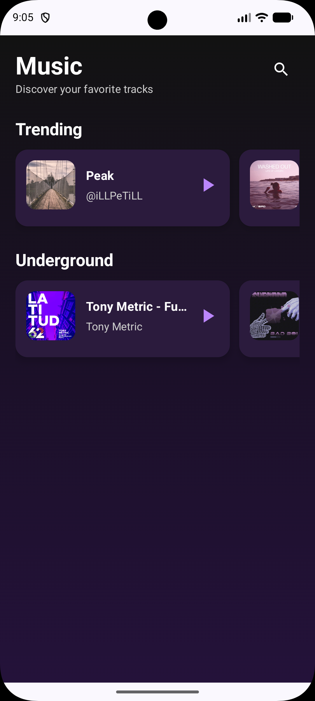
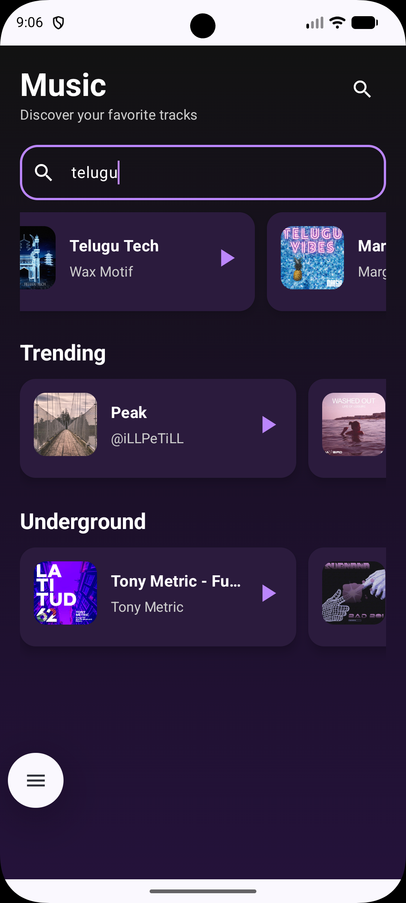
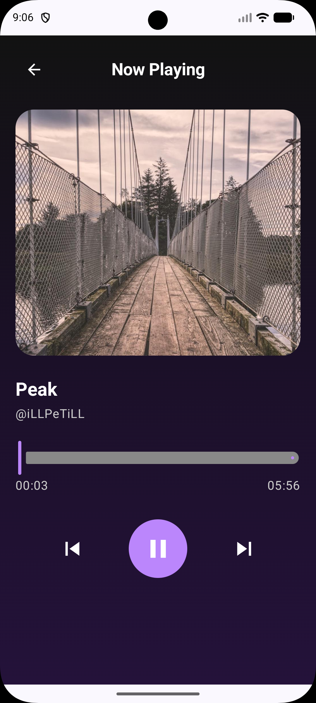

# MusicPlayerTemplate

A modern, high-performance Android music streaming application built with **Jetpack Compose** and **Jetpack Media3**. This project serves as a robust template for music players, integrating with the **Audius API** to provide a seamless streaming experience.

## 🚀 Features

- **Trending & Underground Music:** Discover the latest hits and hidden gems directly from the Audius platform.
- **Advanced Search:** Find tracks by name, genre, or mood with real-time results.
- **Premium Playback Experience:** Powered by **Jetpack Media3 (ExoPlayer)**, supporting background playback and system-wide media controls.
- **Modern UI/UX:** A beautiful, responsive interface built entirely with **Jetpack Compose** and **Material 3**.
- **Type-Safe Navigation:** Secure and reliable screen transitions using the latest Compose Navigation patterns.
- **Clean Architecture:** Scalable and maintainable codebase following SOLID principles and separation of concerns.

## 🛠 Tech Stack

- **Language:** [Kotlin](https://kotlinlang.org/)
- **UI Framework:** [Jetpack Compose](https://developer.android.com/jetpack/compose)
- **Design System:** Material 3
- **Architecture:** Clean Architecture + MVVM
- **Dependency Injection:** [Hilt](https://developer.android.com/training/dependency-injection/hilt-android)
- **Networking:** [Retrofit](https://square.github.io/retrofit/) & [OkHttp](https://square.github.io/okhttp/)
- **Media Playback:** [Jetpack Media3](https://developer.android.com/guide/topics/media/media3)
- **Image Loading:** [Glide](https://github.com/bumptech/glide) & [Coil](https://coil-kt.github.io/coil/)
- **Data Serialization:** Kotlinx Serialization & Gson
- **API:** [Audius API](https://audius.org/api)

## 📂 Project Structure

The project follows a modular Clean Architecture approach:

- **`data/`**: Implements data logic, including Retrofit API services, repository implementations, and DTO-to-Domain mappers.
- **`domain/`**: Contains the core business logic, UseCases, repository interfaces, and pure Kotlin models.
- **`presentation/`**: Manages UI state and business logic via ViewModels.
- **`ui/`**: Houses all Composable screens, components, and theme configurations.
- **`player/`**: Dedicated module for the `Media3` Service implementation and player state management.
- **`di/`**: Hilt modules for dependency management.

## ⚙️ Getting Started

1. **Clone the repository:**
   ```bash
   git clone https://github.com/yourusername/MusicPlayerTemplate.git
   ```
2. **Open in Android Studio:**
   Import the project into Android Studio (Ladybug or newer recommended).
3. **Sync Gradle:**
   Wait for the project to sync and download all dependencies.
4. **Run the App:**
   Connect a device or emulator and hit the **Run** button.


## 📱 Screenshots
### 🏠 Home Screen



### 🔍 Search Music



### 🎵 Music Player


